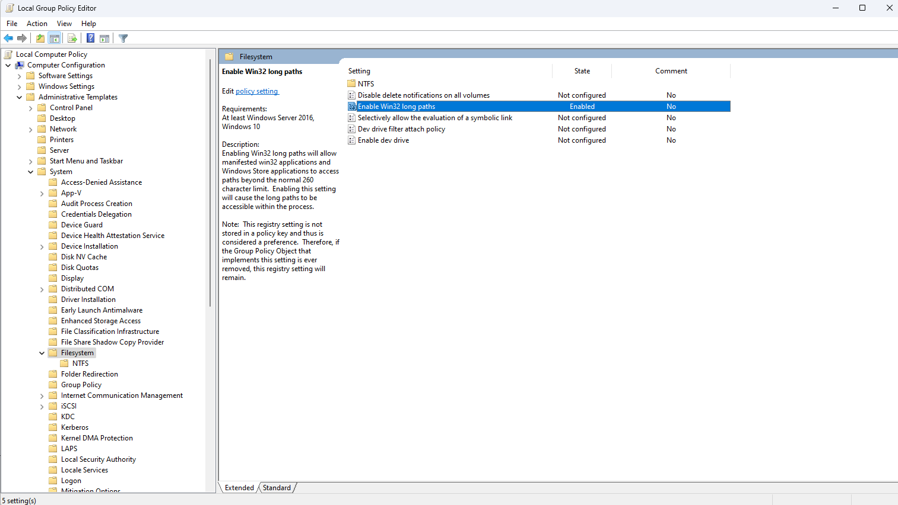

# Installing Chipwhisperer on Windows
*Based on https://chipwhisperer.readthedocs.io/en/latest/windows-install.html by newae*

## 1 WSL and Bash
There have been reported some problems with Windows Subsystem for Linux (WSL) and some of the tools needed for the chipwhisperer lab. These issues seems to be related to the `%%bash` blocks in jupyter. If you get any errors regarding `make`, or any Linux distribution, try disabling WSL or changing `%%bash` to `%%sh`. When testing I (Caroline) did not need WSL installed at all in order to complete the lab.

## 2 Windows long file path
It is recommended to enable long paths on Windows to prevent any files from not being copied during installation of Chipwhisperer.

To enable long paths, open the Local Group Policy editor by pressing `Win + R`, typing `gpedit.msc` and pressing `Return`. Navigate then to `Computer Configuration > Administrative Templates > System > Filesystem` and double click `Enable Win32 long paths`. It should look like the image below. When this is done you need to restart the computer.

## 3 Download Chipwhisperer setup executable
You can download [Chipwhisperer.v5.7.0.Setup.64-bit.exe](https://github.com/newaetech/chipwhisperer/releases/download/5.7.0/Chipwhisperer.v5.7.0.Setup.64-bit.exe) [here](https://github.com/newaetech/chipwhisperer/releases/download/5.7.0/Chipwhisperer.v5.7.0.Setup.64-bit.exe), or you can find the link from newaetech's github release page [here](https://github.com/newaetech/chipwhisperer/releases).

Once the setup executable is downloaded, run it and choose install path. Remember you need to have read/write permissions in the install location, so if using a lab computer avoid installing it in `C:Program Files`. I recommend installing it in your user home directory (default). Follow the setup wizard's recommended installation. I also recommend to tick the box to create a desktop shortcut.

## 4 Running ChipWhisperer
Once the above is completed, running the new `ChipWhisperer.exe` program you installed in the previous step should open a jupyter notebook in your browser. If you didn't tick the `Create a desktop shortcut` box, this should be found in `C:\Users\<username>\ChipWhisperer5_64` if you followed the setup wizard recommended install path.

## 5 Opening the premade lab notebooks
The easiest way to open the lab notebooks is to download the zip file containing the lab notebooks [here](https://todo.com) unzip the files, and place them inside the chipwhisperer jupyter folder located in `C:\Users\<username>\ChipWhisperer5_64\cw\home\portable\chipwhisperer\jupyter`. They should then show up in your jupyter notebook in the browser. You might need to restart `ChipWhisperer.exe` before this takes effect.

## 6 Completing the ChipWhisperer Lab
You are now ready to take on the lab tasks.